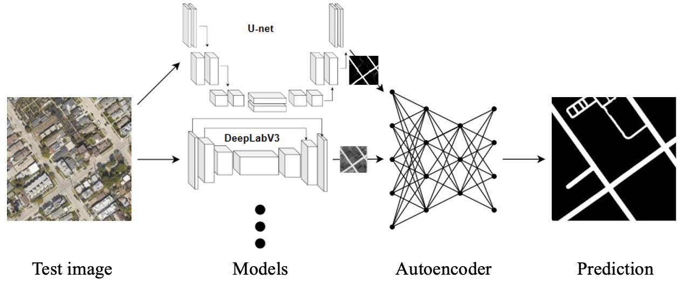
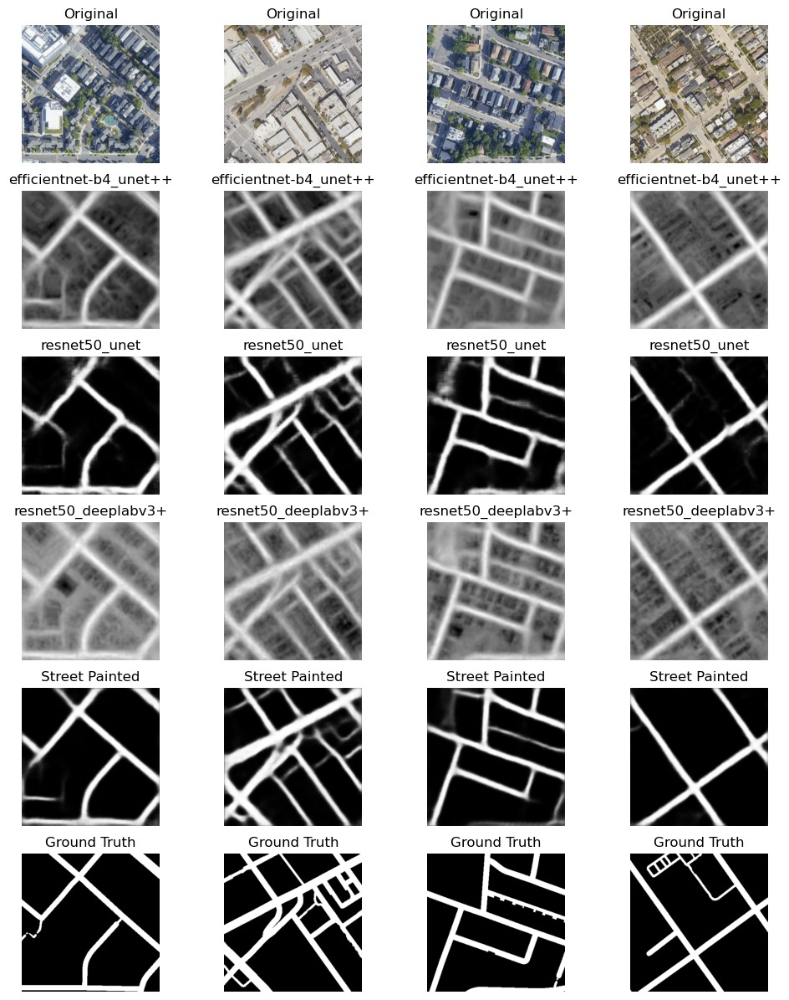

# Road Segmentation Project - Computational Inteligence Lab. Spring 2024

### Team *DiamondsAreMadeUnderPressure*
- Alex Thillen [[athillen@student.ethz.ch](mailto:athillen@student.ethz.ch)]
- Felix Schoellen [[felischo@student.ethz.ch](mailto:felischo@student.ethz.ch)]
- Igor Martinelli [[maigor@student.ethz.ch](mailto:maigor@student.ethz.ch)]
- Roger Csaky-Pallavicini [[croger@student.ethz.ch](mailto:croger@student.ethz.ch)]

## Table of Contents
- [Road Segmentation Project - Computational Inteligence Lab. Spring 2024](#road-segmentation-project---computational-inteligence-lab-spring-2024)
    - [Team *DiamondsAreMadeUnderPressure*](#team-diamondsaremadeunderpressure)
  - [Table of Contents](#table-of-contents)
  - [Project overview](#project-overview)
  - [Setup instructions](#setup-instructions)
    - [Requirements](#requirements)
    - [Training data](#training-data)
    - [Usage](#usage)
  - [Reproducibility](#reproducibility)
  - [Results](#results)

## Project overview

In this project, we introduce a technique for per-pixel road labeling in high-resolution aerial images. The rapid increase in satellite data volume renders manual labeling impractical, highlighting the need for automated processing through advanced computer vision methods.

We propose our solution *Street Artist*, an innovative autoencoder model designed for enhanced road segmentation tasks. Our primary contribution lies in a novel autoencoder capable of integrating the predictions of several pretrained segmentation models, including those based on popular architectures such as [UNet](https://arxiv.org/abs/1505.04597), [UNet++](https://arxiv.org/abs/1807.10165), and [DeepLab V3+](https://arxiv.org/abs/1802.02611). Unlike traditional approaches, our autoencoder utilizes partially frozen pretrained (ImageNet) [ResNet50](https://arxiv.org/abs/1512.03385) encoders, ensuring the robustness and efficiency of the segmentation process.


The architecture of *Street Artist* looks as follows:



For more details and results, please read our [Report](assets/report.pdf).

## Setup instructions

### Requirements

For environment management, we use [Anaconda](https://www.anaconda.com/).

To initialize and load the environment, install [conda](https://www.anaconda.com/download) and run:

```bash
conda env create -f environment.yml
conda activate road-segmentation
```
### Training data
This repositority contains all the training data that we used for our submission.
- `data/raw/training/` contains the training data from the Kaggle competition
- `data/external/curated_100/training/` contains 400 images obtained by curating and splitting 100 images from the [DeepGlobe Road Extraction Dataset](https://www.kaggle.com/datasets/balraj98/deepglobe-road-extraction-dataset)
- `data/raw/test/` contains the test data from the Kaggle competition

In addition, one can put their own training data set into `data/external/training/` and use `notebooks/evaluate_streetartist.py` to curate and split the training images. Curating is done by selecting the images with the largest file size, since images of urban areas (which are more in line with the competition dataset) usually have a larger file size.

### Usage

The `src/` directory contains the following runnable scripts:
- `baseline.py` creates the three baseline submissions
- `train_models.py` trains the individual models of *Street Artist* (requires less than 8GB of VRAM). The trained model weights are saved into `submission_weights/`.
- `train_streetartist.py` trains the *Street Artist* encoder (requires 12GB of VRAM) with the model weights from `submission_weights/`
- `evaluate_streetartist.py` creates a prediction on the test data with *Street Artist*
- `generatePlots.py` generates plots of the validation f1 score vs epochs from training logs

In addition to the python scripts, we provide Jupyter Notebooks in the `notebooks/` directory which can be used instead:

- `baselines.ipynb` creates the three baseline submissions
- `StreetArtist.ipynb` combines the functionality of `train_models.py`, `train_streetartist.py` and `evaluate_streetartist.py`
- `curate_image_set.ipynb` to preprocess training data (see [Training Data](#training-data}))


## Reproducibility

To reproduce our results:

1. Download the model weights from [here](https://www.swisstransfer.com/d/65639f5e-38bd-414c-bcd2-41f2c96dd34e)
2. Import the weights into `submission_weights/`
3. Download additional training images from [here](https://drive.google.com/file/d/1j0dtVs9LDlUSKpuIbxbEjUOCo3zpvHMh/view?usp=sharing)
4. Put the original image set into `/data/raw/` and the additional, just downloaded images into  `data/external/curated_100` 
5. Run `src/evaluate_streetartist.py` to create a submission file based on the test data

## Results
Below is an example of road segmentation done by *Street Artist*. Further analysis can be found in our [Report](assets/report.pdf).




